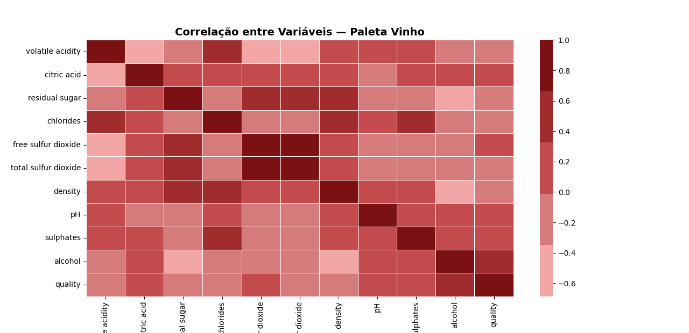
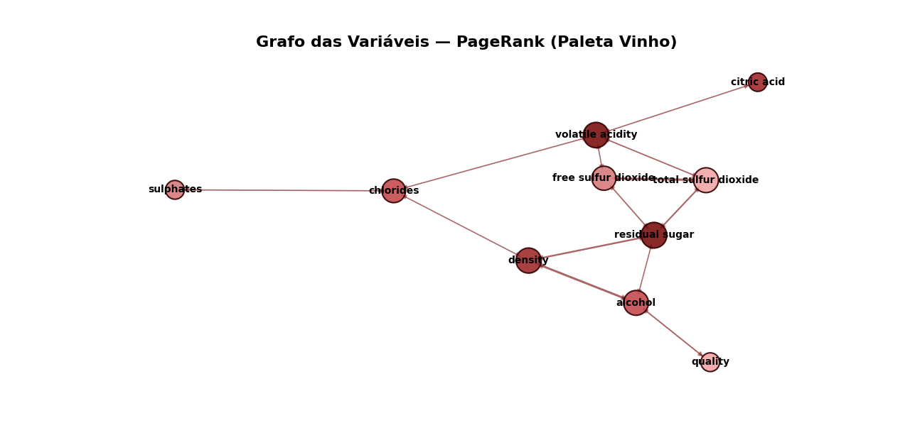
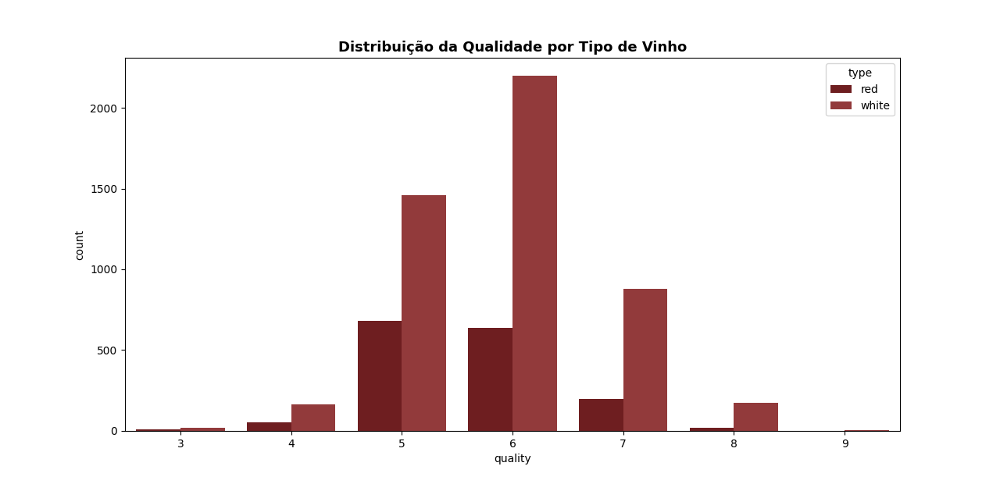
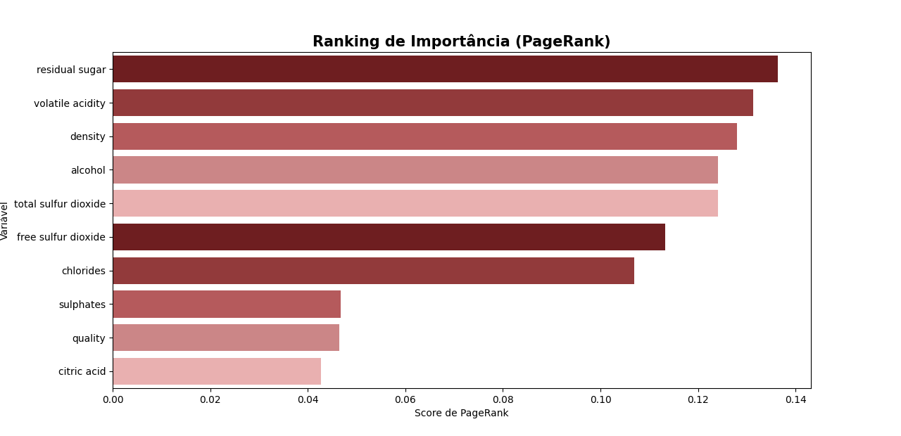

# PageRank

## Introdução
Este relatório apresenta uma análise de importância das variáveis químicas do dataset de vinhos (vinhos brancos e tintos). O objetivo principal é:

Explorar os dados e entender sua estrutura;

Visualizar relações entre variáveis;

Criar um grafo de correlações;

Aplicar PageRank, um algoritmo originalmente usado pelo Google para medir relevância de páginas, aqui utilizado para medir importância das variáveis no contexto das correlações do dataset;

Interpretar quais fatores mais influenciam a qualidade e a composição do vinho

## Exploração dos Dados
A saída a seguir confirma que o dataset contém 6.497 observações e 12 colunas, todas completas.

Saída do Terminal — Estrutura do Dataset
Data columns (total 12 columns):
 #   Column                Non-Null Count  Dtype
---  ------                --------------  -----
 0   volatile acidity      6497 non-null   float64
 1   citric acid           6497 non-null   float64
 2   residual sugar        6497 non-null   float64
 3   chlorides             6497 non-null   float64
 4   free sulfur dioxide   6497 non-null   float64
 5   total sulfur dioxide  6497 non-null   float64
 6   density               6497 non-null   float64
 7   pH                    6497 non-null   float64
 8   sulphates             6497 non-null   float64
 9   alcohol               6497 non-null   float64
 10  quality               6497 non-null   int64
 11  type                  6497 non-null   object
dtypes: float64(10), int64(1), object(1)
memory usage: 659.9+ KB

# Estatísticas descritivas
count  mean   std   min   25%   50%   75%   max
... (valores completos conforme enviado)


Essas informações ajudam a entender a variabilidade das variáveis químicas e da qualidade dos vinhos.

## Visualizações

# Mapa de Calor de Correlação

O gráfico abaixo apresenta a matriz de correlação entre as variáveis químicas. A paleta vinho facilita identificar relações fortes e fracas.

=== "Heatmap de Correlação Gráfico"
    

Interpretação principal:

Algumas variáveis possuem forte correlação entre si, como free sulfur dioxide e total sulfur dioxide.

Outras praticamente não se conectam fortemente, indicando pouca influência direta

# Distribuição da Qualidade por Tipo de Vinho


=== "Distribuição de Qualidade por Tipo Gráfico"
    

A maior parte dos vinhos — tanto brancos quanto tintos — se concentra em notas 5 e 6, o que é esperado pelo perfil do dataset. Poucos possuem notas extremas (3, 4, 8 e 9).

# Grafo das Variáveis (Redes de Correlação)

=== "Redes de Correlação Gráfico"
    


Cada nó representa uma variável do dataset.

As conexões entre variáveis representam correlações acima de um limiar definido.

O tamanho e cor do nó indicam sua importância relativa segundo o PageRank.

## PageRank — Ranking de Importância das Variáveis

O algoritmo PageRank calcula a importância de cada variável a partir das conexões que ela possui dentro da rede de correlações.

Saída do Terminal — PageRank

Grafo criado com 10 nós e 26 arestas.

Ranking das variáveis por PageRank:
               variavel  pagerank
5        residual sugar  0.136305
0      volatile acidity  0.131316
6               density  0.128019
7               alcohol  0.124142
4  total sulfur dioxide  0.124122
3   free sulfur dioxide  0.113275
2             chlorides  0.106966
8             sulphates  0.046680
9               quality  0.046456
1           citric acid  0.042718

# Gráfico do Ranking (PageRank)

=== "PageRank Gráfico"
    


## Interpretação dos Resultados
 Variável mais importante: residual sugar (açúcar residual)

Isso indica que o açúcar residual:

é altamente conectado com outras variáveis relevantes;

exerce papel central na rede química do vinho;

é geralmente indicador de corpo, dulçor e características sensoriais.

# Volatile acidity, density e alcohol

Essas três também aparecem com valores altos:

volatile acidity → impacto direto no aroma (cheiro de vinagre quando alto).

density → fortemente associada ao teor de açúcar e álcool.

alcohol → uma das variáveis que mais influenciam a qualidade e equilíbrio.

# Sulfur dioxide (livre e total)

Ambas são importantes no controle de oxidação e conservação do vinho.

➖ Menores valores: citric acid, quality

Isso não significa que qualidade não é importante, mas sim que:

a variável qualidade não influencia outras; ela é resultado, não causa;

citric acid tem baixa conectividade no conjunto.

## Conclusão Geral

A análise via PageRank permitiu identificar quais variáveis possuem maior conectividade e relevância estrutural dentro da rede química do vinho.

Principais conclusões:

Açúcar residual é a variável mais central e importante no dataset.

Ácido volátil, densidade e álcool também têm papel relevante na estrutura química.

A variável qualidade aparece com baixa importância porque ela recebe influência, mas não influencia outras variáveis.

O PageRank mostrou-se uma excelente abordagem para analisar sistemas multivariados com forte interdependência.

Em resumo, o PageRank nos ajudou a entender o “coração químico” do vinho — revelando quais variáveis mais conectam e influenciam todo o sistema.

## Código
=== "Code"
```python 
--8<-- "docs/PageRank/teste2.py"
```