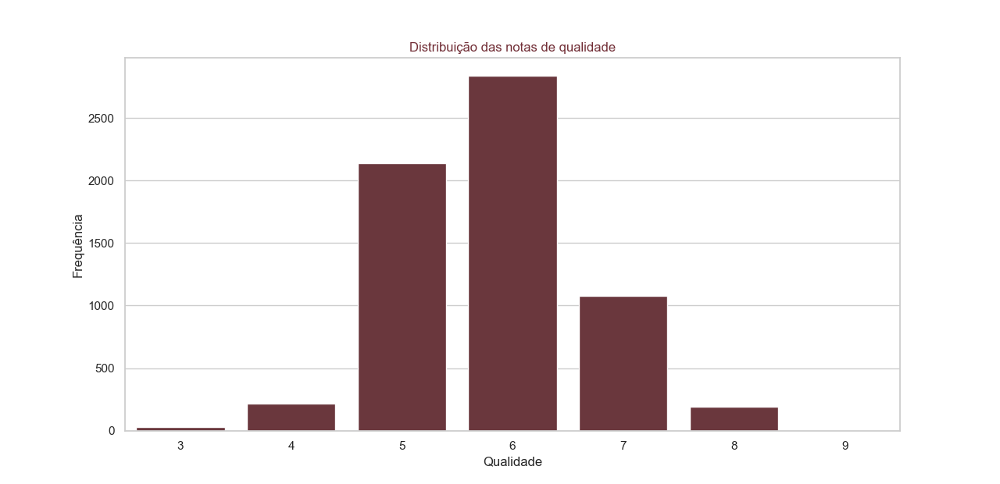
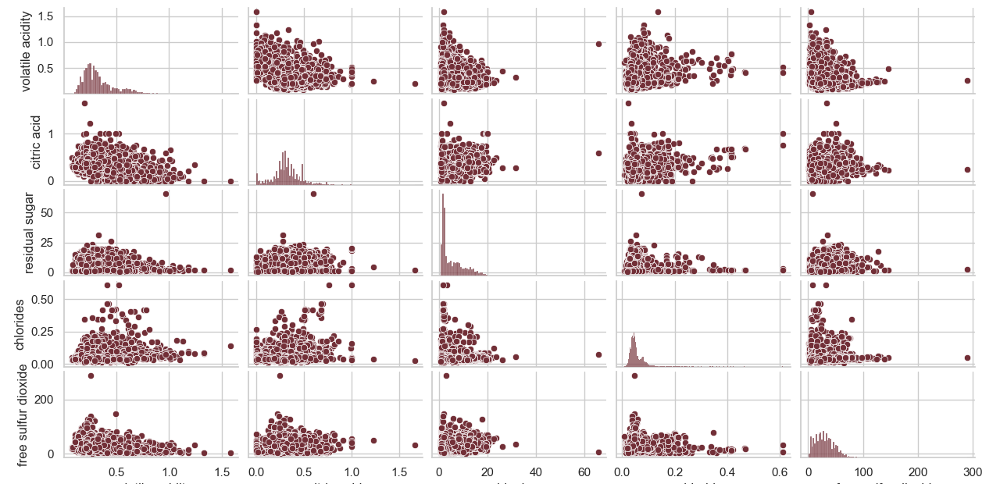
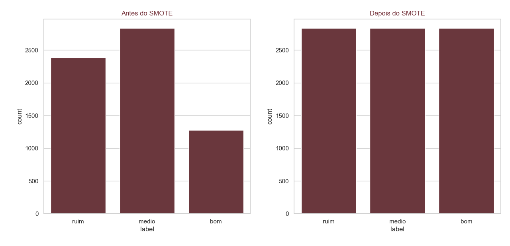
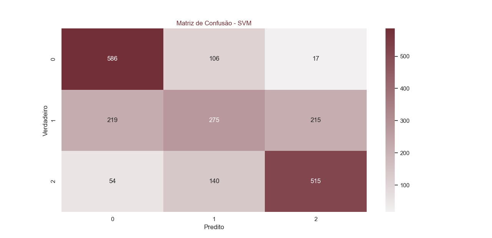
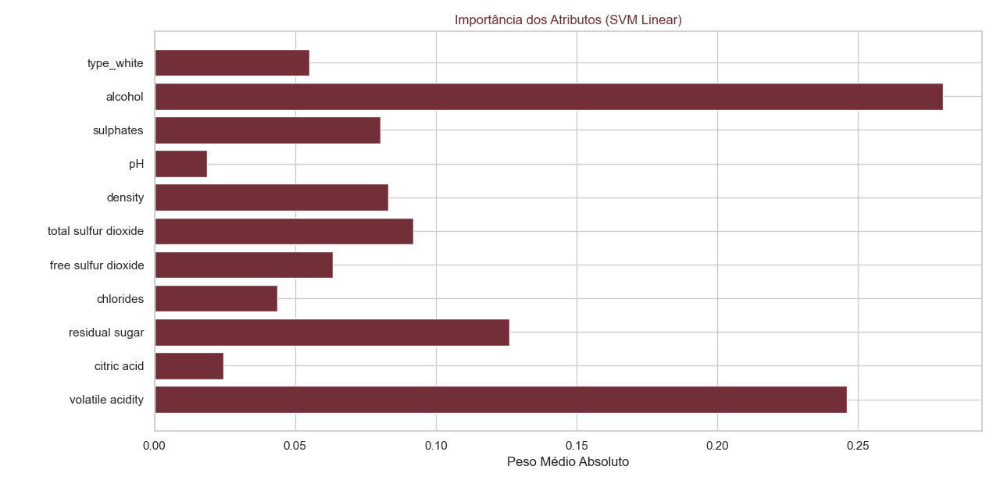

# Support Vector Machine

## Introdução

O objetivo dessa analise é ver  o desempenho do algoritmo SVM (Support Vector Machine) na classificação da qualidade de vinhos, utilizando o dataset Wine Quality (vinhos tintos e brancos).
O conjunto de dados apresenta desequilíbrio nas classes, o que pode prejudicar modelos supervisionados. Por isso, adotamos a técnica SMOTE (Synthetic Minority Oversampling Technique) para balancear as classes antes do treinamento.

Além disso,foi realizado análise exploratória, geração de gráficos explicativos e avaliação do modelo por matriz de confusão e relatório de classificação.

# Dataset

O dataset possui características físico-químicas dos vinhos, como acidez, açúcar residual, pH, álcool, dentre outras, além da variável quality (0–10).

As classes foram convertidas em categorias:

ruim = notas ≤ 5

medio = nota = 6

bom = notas ≥ 7


# Distribuição original das notas de qualidade

A figura abaixo mostra que o dataset é desbalanceado, com predominância da classe medio.
=== "Distribuição da qualidade (ANTES do balanceamento)"
    

# Pairplot das primeiras variáveis

O pairplot a seguir exibe as relações entre algumas variáveis contínuas do dataset.
=== "Pairplot das primeiras colunas"
    

# Balanceamento das Classes com SMOTE

Como as classes são desiguais, aplicamos o SMOTE apenas após a normalização, para gerar novos exemplos sintéticos das classes minoritárias.

Isso melhora a capacidade do SVM de encontrar margens mais equilibradas entre as classes.

# Distribuição após SMOTE

=== "Observe como as classes ficam distribuídas uniformemente após o SMOTE"
    

# Treinamento com SVM

Utilizamos:

kernel = rbf

C = 2

gamma = scale

O conjunto foi dividido em:

75% treino

25% teste

Com stratify, garantindo proporção de classes

# Avaliação do Modelo
 ## Matriz de Confusão

A matriz de confusão mostra como o modelo classificou corretamente (diagonal) e onde ocorreram erros.

=== " Matriz de Confusão do SVM "
    

# Classification Report

Inclui métricas por classe:

Precision

Recall

F1-score


=== " Relatório de Classificação "
    

# Conclusão

O uso do SMOTE foi fundamental para corrigir o desbalanceamento presente no dataset original.
Isso permitiu que o SVM construísse margens mais estáveis e equilibradas, melhorando o desempenho nas classes minoritárias.

Principais resultados:

✔ O SVM obteve boa precisão geral.

✔ O recall das classes minoritárias aumentou após SMOTE, evitando viés para a classe "medio".

✔ A matriz de confusão indica que o modelo captura bem a classe "bom", que antes era minoritária.

✔ O relatório de classificação mostra F1-scores equilibrados entre as classes.

Pontos de melhoria

Ajuste de hiperparâmetros (GridSearchCV).

Testar outros kernels (poly, sigmoid).

Testar PCA para redução de dimensionalidade.

Testar modelos alternativos (Random Forest, XGBoost).

## Código
=== "Code"
```python 
--8<-- "docs/SVM/teste2.py"
```


