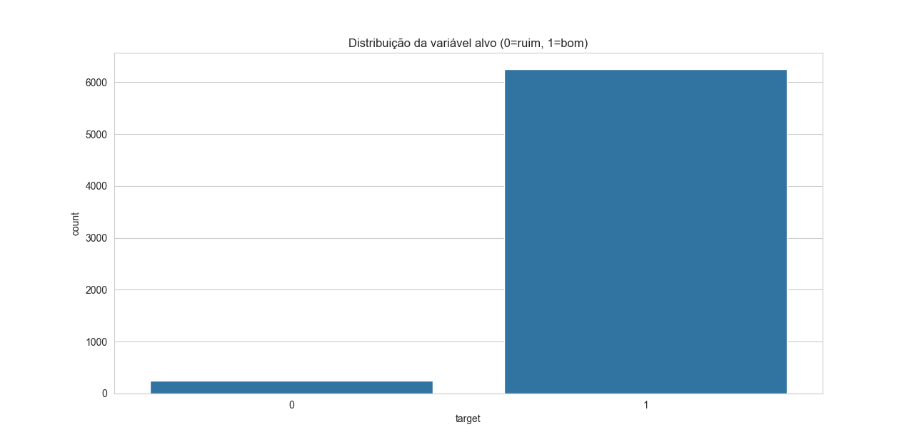
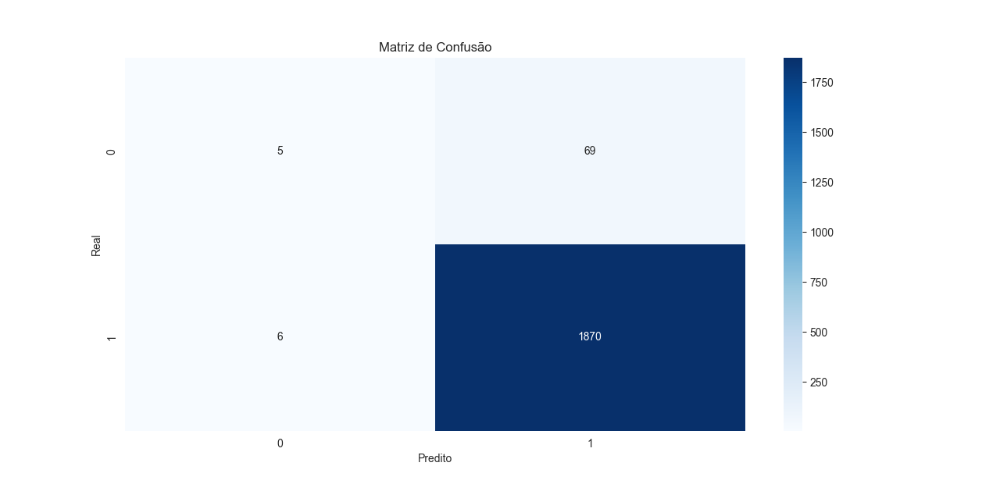
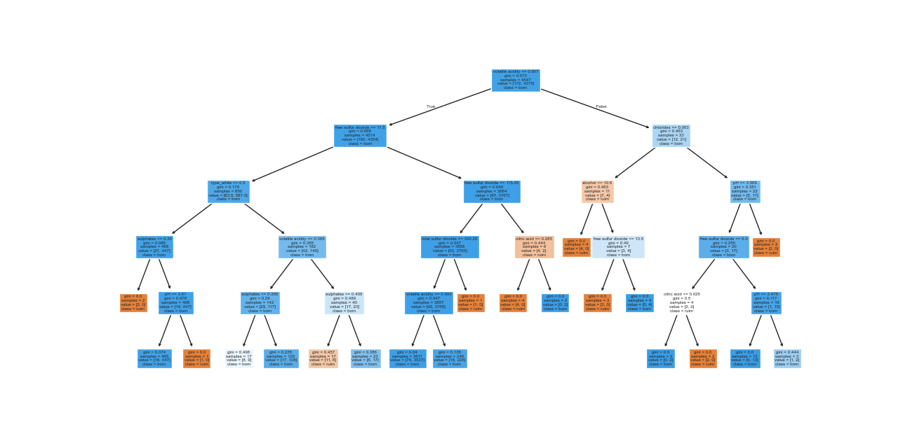

## Exploração de dados
A variável target foi criada a partir da coluna quality, classificando os vinhos em duas categorias:

0 (ruim): vinhos com qualidade menor que 5;

1 (bom): vinhos com qualidade maior ou igual a 5.

No gráfico abaixo, é possível observar um forte desbalanceamento entre as classes. A grande maioria dos vinhos foi classificada como “bons” (1), enquanto apenas uma pequena parcela foi classificada como “ruins” (0).

Resumo do conjunto de dados
Total de linhas: 6.497
Total de colunas: 12
Variável de destino: quality (valores inteiros de 3 a 9)
Formato de arquivo: CSV (UTF-8)
Valores ausentes: Nenhum
Duplicatas removidas: Sim

1    6251
0     246

## Exploração dos Dados	Gráfico


## Exploração dos Dados	Código
``` python
--8<-- "./docs/arvore-decisao/teste.py"
```
## Pré-processamento
1-Verifica se há valores nulos.

2-Define features (X) e variável alvo (y).

3-Converte variáveis categóricas em dummies (se tiver).

4-Divide em treino (70%) e teste (30%).

## Código Pré-processamento

``` python
--8<-- "./docs/arvore-decisao/preprocessamento.py"
```
## Explicação do Pré-processamento
Verificou-se a ausência de valores faltantes no dataset. As variáveis independentes foram selecionadas, excluindo-se quality e target. As variáveis categóricas foram codificadas por meio de dummies (one-hot encoding) para permitir a leitura pelo modelo. Por fim, o conjunto de dados foi dividido em treino (70%) e teste (30%), de forma estratificada para manter a proporção da variável alvo

## Modelo Árvore de Decisão

``` python
--8<-- "./docs/arvore-decisao/ModeloArv.py"
```
## Descrição

Treinamento do modelo- Cria uma árvore de decisão limitada a profundidade 5 (para não crescer demais) e treina com os dados de treino.

Avaliação- az previsões com os dados de teste e calcula métricas

O modelo foi avaliado nos dados de teste com métricas de desempenho. A acurácia foi de cerca de 96%, mostrando boa performance geral. A precisão, recall e F1-score foram altos para vinhos bons, mas baixos para vinhos ruins, devido ao desbalanceamento do conjunto de dados.

Acurácia: mede a proporção total de acertos do modelo. No experimento, o modelo apresentou uma acurácia de aproximadamente 96%, indicando bom desempenho geral.

Precisão: avalia, dentre as amostras previstas como “boas”, quantas realmente pertenciam a essa classe. O modelo mostrou alta precisão para a classe majoritária (vinhos bons).

Recall: mede a capacidade de identificar corretamente todos os casos da classe positiva. O recall também foi alto para vinhos bons, mas baixo para vinhos ruins, devido ao desbalanceamento da base.

F1-Score: combina precisão e recall em uma única métrica. Os valores foram satisfatórios para vinhos bons, mas menores para vinhos ruins, reforçando a dificuldade do modelo em prever a classe minoritária.

## Matriz de confusão



## Código da Matriz de confusão

``` python
--8<-- "./docs/arvore-decisao/Matriz.py"
```

## Descrição Matriz

A matriz de confusão mostra os seguintes resultados:

Verdadeiro Negativo (TN) = 5 → vinhos ruins corretamente classificados como ruins.

Falso Positivo (FP) = 69 → vinhos ruins incorretamente classificados como bons.

Falso Negativo (FN) = 6 → vinhos bons incorretamente classificados como ruins.

Verdadeiro Positivo (TP) = 1870 → vinhos bons corretamente classificados como bons.

Isso indica que o modelo tem ótimo desempenho na identificação de vinhos bons (classe 1), conseguindo classificar corretamente a grande maioria desses casos. No entanto, o desempenho é muito baixo para vinhos ruins (classe 0), já que praticamente não consegue reconhecê-los.

Esse comportamento está diretamente relacionado ao desbalanceamento do conjunto de dados, onde os vinhos bons são muito mais numerosos que os ruins. Como consequência, o modelo "aprende" a priorizar a classe majoritária (bons) e tem dificuldade em identificar a classe minoritária (ruins).

## Visualizar a árvore



## Código da visualização da árvore

``` python
--8<-- "./docs/arvore-decisao/arvore.py"
```
## Explicação da árvore


## Conclusão final : Relatório de Classificação 

Accuracy (Acurácia): 96% → parece muito bom, mas é enganador.

Precision e Recall para classe 0 (ruim):

Precision = 0.45 → Quando ele diz que é ruim, só 45% estão realmente corretos.

Recall = 0.07 → Ele só encontra 7% dos vinhos ruins!

Classe 1 (bom): quase perfeito, acerta praticamente todos.

 Conclusão: o modelo é ótimo para prever vinhos bons, mas péssimo para prever vinhos ruins.