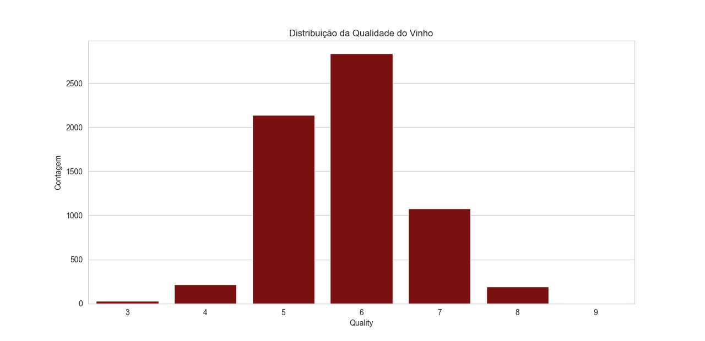
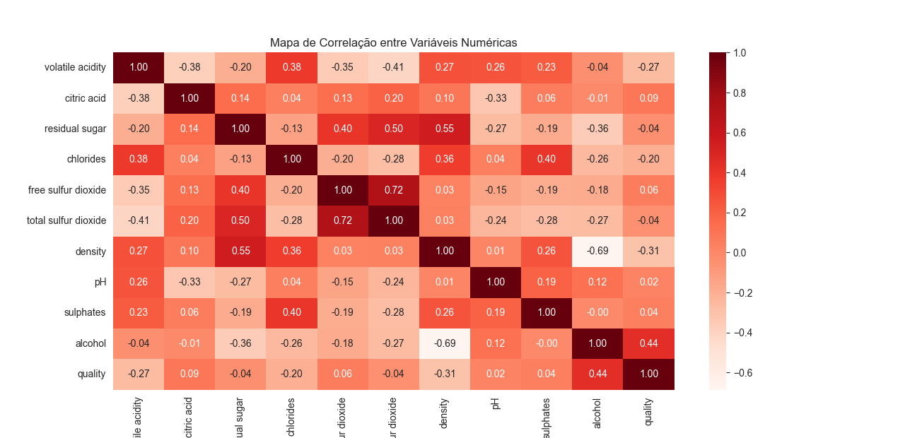
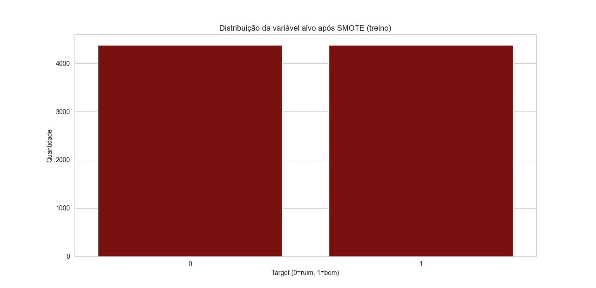
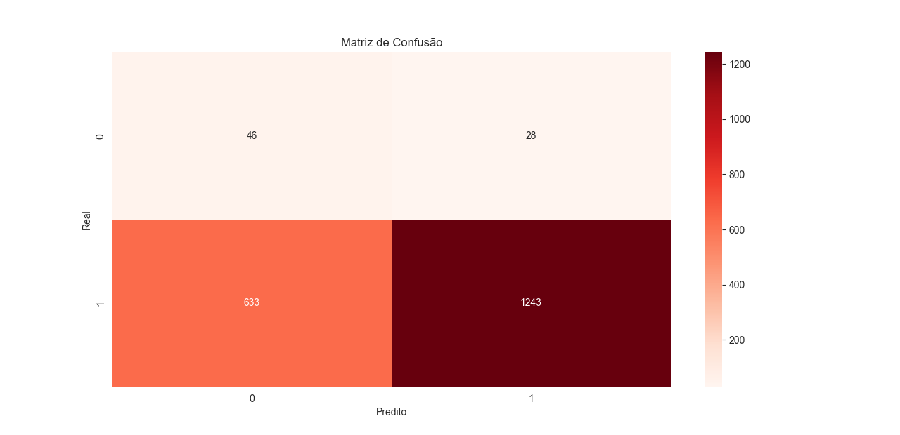
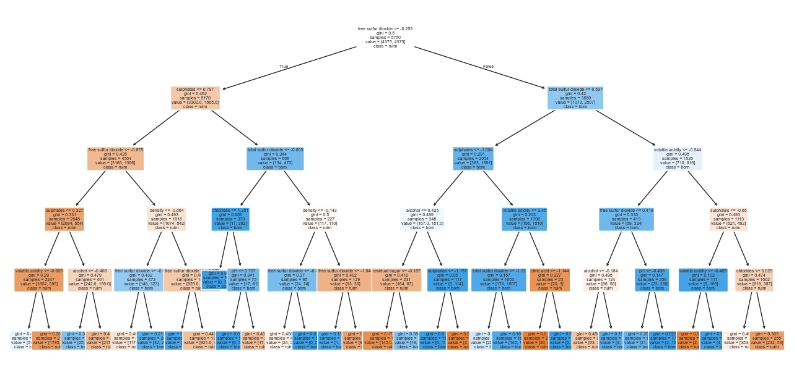

## Exploração de dados
O dataset utilizado foi o Wine Quality (red and white wines) disponível no Kaggle, contendo informações físico-químicas de 6.497 vinhos (tintos e brancos).
Cada vinho possui variáveis como acidez, pH, açúcar residual, dióxido de enxofre, teor alcoólico e outros parâmetros laboratoriais.
O objetivo é prever a qualidade do vinho, originalmente representada em uma escala de 3 a 9.

Resumo do conjunto de dados
Total de linhas: 6.497
Total de colunas: 12
Variável de destino: quality (valores inteiros de 3 a 9)
Formato de arquivo: CSV (UTF-8)
Valores ausentes: Nenhum
Duplicatas removidas: Sim

# Estatísticas iniciais

Total de registros: 6.497

Variáveis: 12 (10 numéricas, 1 categórica e a variável alvo quality)

Distribuição da qualidade é desbalanceada, concentrada principalmente em notas 5, 6 e 7.

=== "Distribuição da Qualidade	Gráfico"
    

=== "Mapa de Correlação entre Variáveis Numéricas"
    


##Pré-processamento

As seguintes etapas foram realizadas:

Remoção de valores ausentes (dataset estava praticamente completo).

Criação de uma variável binária target, onde:

0 = vinho ruim (qualidade < 5)

1 = vinho bom (qualidade ≥ 5)

Padronização das variáveis numéricas com StandardScaler.

Transformação da variável categórica type (vinho tinto/branco) em dummies.

Distribuição original do target:

Bons vinhos: 6.251

Ruins: 246

##Divisão dos Dados

O dataset foi dividido em:

Treino: 70% dos dados (4.547 amostras)

Teste: 30% dos dados (1.950 amostras)

Antes do balanceamento, o treino estava desbalanceado.
Para corrigir, foi aplicado SMOTE (Synthetic Minority Oversampling Technique), resultando em uma distribuição equilibrada:

=== "Distribuição após SMOTE	Gráfico"
    


## Treinamento do Modelo

O modelo utilizado foi a Árvore de Decisão (DecisionTreeClassifier), com:

max_depth=5

random_state=42

## Avaliação do Modelo

O modelo foi avaliado no conjunto de teste.

Métricas obtidas:

Acurácia: 66,1%

Precisão: 97,8%

Recall: 66,2%

F1-score: 78,9%

O modelo apresentou acurácia de 66,1%, indicando que acerta cerca de 2 em cada 3 casos. A precisão foi bastante elevada (97,8%), mostrando que quase todas as previsões positivas realmente pertencem à classe correta. No entanto, o recall foi moderado (66,2%), revelando que o modelo deixa de identificar parte dos casos reais. O F1-score de 78,9% indica um equilíbrio razoável, mas com desempenho mais voltado para alta precisão do que para ampla cobertura.

=== "Distribuição após SMOTE	Gráfico"
    

=== "Distribuição após SMOTE	Gráfico"
    

=== "Distribuição após SMOTE	Gráfico"
    

## Conclusão

O modelo de árvore de decisão apresentou desempenho razoável, com boa precisão, mas menor recall para vinhos ruins, indicando dificuldade em identificar corretamente essa classe minoritária.

Pontos fortes:

Boa interpretabilidade (fácil visualização da árvore).

Identificação clara das variáveis mais importantes, como:

Free sulfur dioxide

Sulphates

Total sulfur dioxide

Alcohol

## Código da arvore de decisão

=== "Code"
```python 
--8<-- "docs/arvore-decisao/teste4.py"
```

