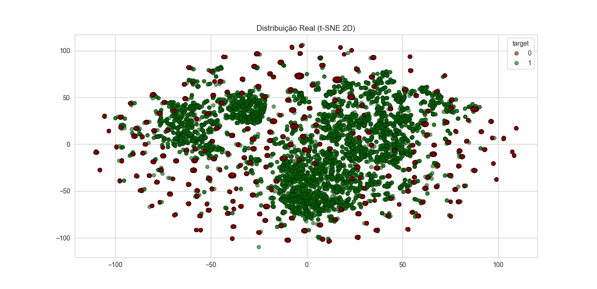
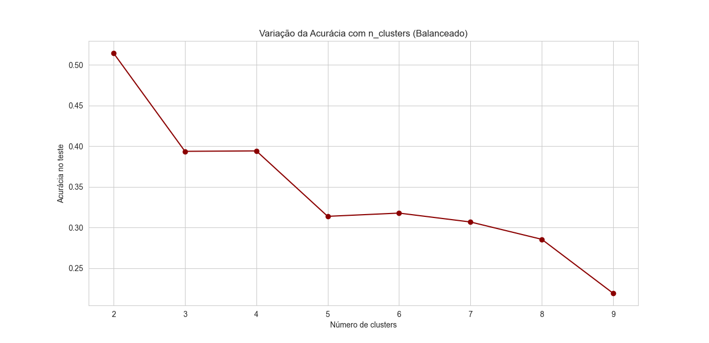
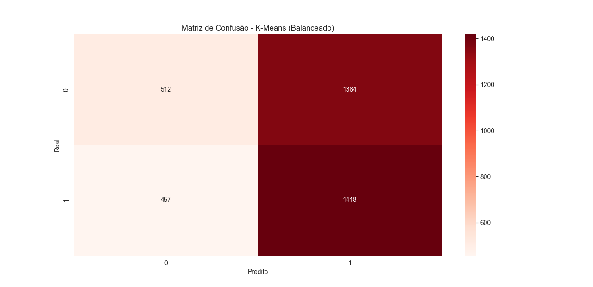
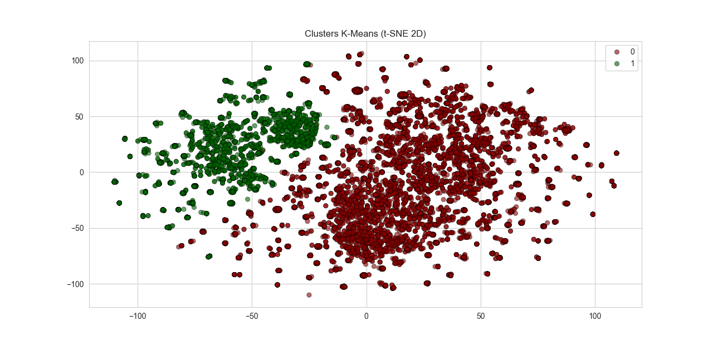

# K-Means

## Exploração dos Dados 

O dataset utilizado contém 6.497 registros e 12 variáveis, relacionadas às propriedades físico-químicas dos vinhos (como acidez, açúcar residual, pH, álcool etc.), além de duas colunas-alvo:

quality (qualidade sensorial, variando entre 3 e 9);

type (vinho tinto ou branco).

## Exemplo dos primeiros registros:
volatile acidity  citric acid  residual sugar  chlorides  ...  sulphates  alcohol  quality  type

7.4               0.70         0.00             1.9      0.076  ...  0.56  9.4  5  red

7.8               0.88         0.00             2.6      0.098  ...  0.68  9.8  5  red


-Não há valores ausentes.

-A variável quality é desbalanceada (maioria entre 5 e 6).

-Para a classificação binária (target), o dataset foi balanceado (classe 0 ≈ 6.251, classe 1 ≈ 6.251).


## Pré-processamento

Normalização foi aplicada às variáveis numéricas (StandardScaler).

O dataset foi balanceado para reduzir o viés.

Divisão em treino e teste: 70% treino (8.751 registros) e 30% teste (3.751 registros).


## Treinamento com K-Means

O algoritmo foi treinado com n_clusters = 2, correspondente às duas classes do target.

Diferente do KNN, o K-Means não usa os rótulos durante o treinamento (não supervisionado).

# Resultados e Avaliação

## Distribuição Real (t-SNE 2D)

Cada ponto representa uma amostra, projetada em 2 dimensões via t-SNE. As cores correspondem ao rótulo real do target (0 = vinho de menor qualidade, 1 = vinho de maior qualidade).
Observa-se uma grande sobreposição entre as classes, o que indica que os dados não são facilmente separáveis por clustering.

=== "Distribuição Real Gráfico"
    

## Variação da Acurácia com número de clusters

A acurácia cai rapidamente à medida que o número de clusters aumenta.

Com 2 clusters, a acurácia máxima foi ≈ 0.51.

A partir de 3 clusters, o desempenho piora, indicando que mais agrupamentos não representam bem os dados.

=== " Variação da Acurácia Gráfico"
    


## Matriz de Confusão
 [[ 512 1364]
 [ 457 1418]]

O modelo acertou alguns padrões, mas apresentou muitos falsos positivos e falsos negativos.

Isso confirma a baixa capacidade do K-Means em distinguir as duas classes no espaço original.

=== " Matriz de Confusão Gráfico"
    


## Clusters obtidos (t-SNE 2D)

Aqui vemos a separação encontrada pelo K-Means.

Apesar de uma divisão visível, há grande discrepância em relação às classes reais.

O cluster "0" concentra mais amostras, mas não corresponde diretamente a uma classe do target.

=== " Clusters Gráfico"
    


## Métricas de Desempenho

Acurácia: 0.5145

Precision classe 0: 0.53

Recall classe 0: 0.27

Precision classe 1: 0.51

Recall classe 1: 0.76

Adjusted Rand Index (ARI): 0.00064 (muito baixo, indicando que os clusters pouco coincidem com as classes reais).

## Conclusão

O modelo de K-Means não se mostrou adequado para classificar este dataset:

A acurácia foi próxima ao aleatório (≈50%).

Houve alta confusão entre as classes, confirmada pela matriz de confusão e pelo ARI próximo de zero.

A forte sobreposição observada no t-SNE justifica esse baixo desempenho, já que os vinhos de diferentes qualidades compartilham características físico-químicas semelhantes.

Possíveis melhorias:

Testar outras técnicas de redução de dimensionalidade (PCA antes do clustering).

Aplicar algoritmos de clustering mais flexíveis, como DBSCAN ou Gaussian Mixture Models (GMM).

Realizar seleção de variáveis, mantendo apenas as mais relevantes para discriminar as classes.

## Código do K-Means

=== "Code"

```python 
--8<-- "docs/kmeans/teste1.py"
```

