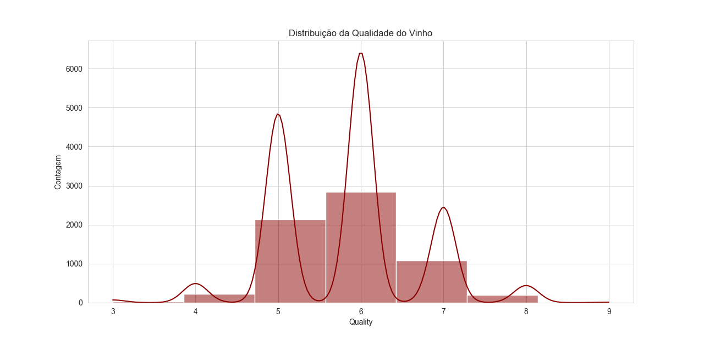
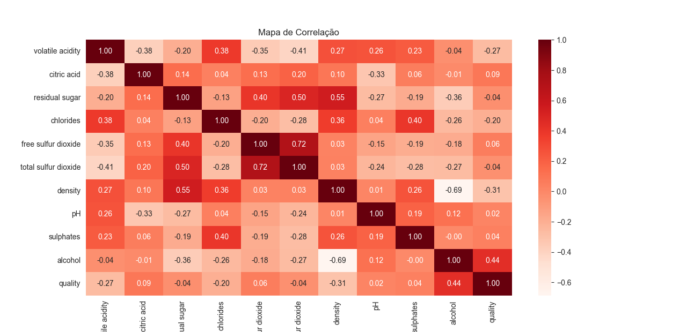
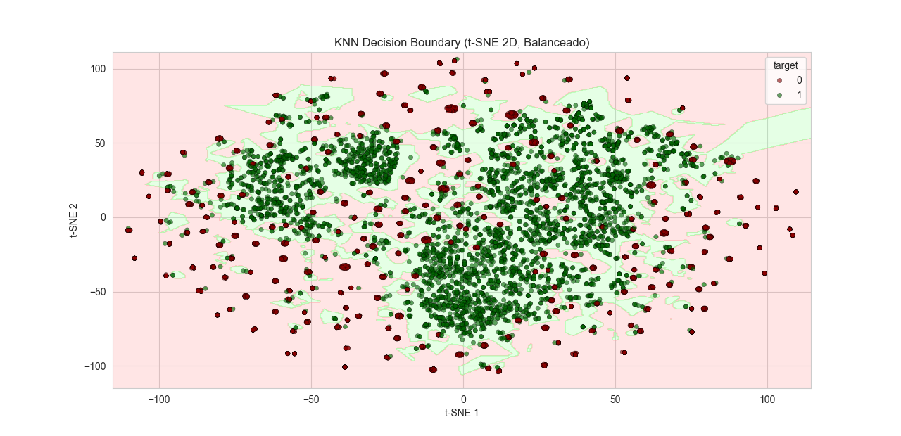
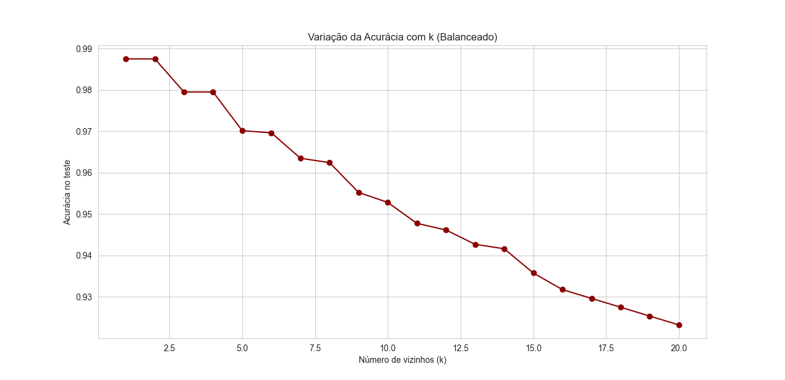
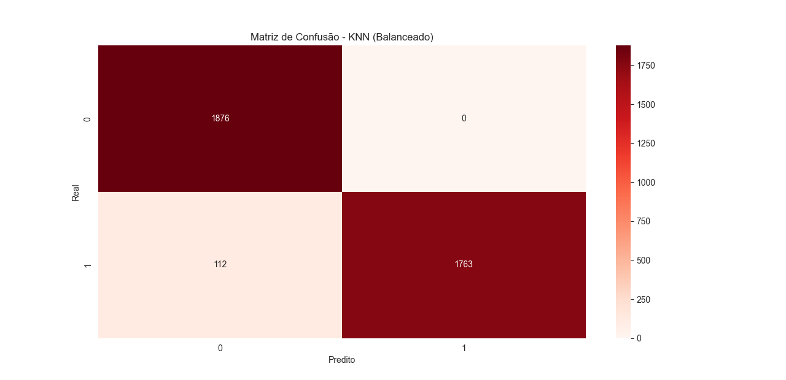

# Exploração de dados KNN

## Entendimento dos Resultados do Dataset

Total de registros: 6.497 vinhos (tintos e brancos).

Variáveis: 12 físico-químicas + qualidade (target).

Sem valores ausentes. 

## Distribuição da variável quality

Maioria concentrada em notas 5 e 6.

Notas baixas (3-4) e altas (8-9) são raras.

Indica forte desbalanceamento natural.

## Variável alvo (target binário)

Criada como: vinho bom (1) e ruim (0).

Bons vinhos: 6.251 registros.

Ruins: 246 registros.

O melhor entendimento sobre o Dataset está em [Árvore de Decisão](../arvore-decisao/main.md)

## Desempenho do Modelo KNN

Treino: 4.547 registros

Teste: 1.950 registros

Acurácia geral: ~96%

Relatório de Classificação

Classe 0 (ruins) → Precision: ~0.38 | Recall: ~0.04 | F1: ~0.07
Classe 1 (bons) → Precision: ~0.96 | Recall: ~1.00 | F1: ~0.98

Classe 1 (bons vinhos): desempenho excelente, quase todos corretamente classificados.

Classe 0 (ruins): desempenho muito baixo, modelo quase não identifica essa classe.

## Distribuição da Qualidade do Vinho

A maioria dos vinhos avaliados possui qualidade entre 5 e 6, evidenciando uma concentração no nível “mediano”. Isso mostra que o dataset não segue uma distribuição normal, mas sim enviesada para valores centrais. Há poucos registros de vinhos de qualidade muito baixa (3-4) ou muito alta (8-9), o que caracteriza uma base desbalanceada. Esse desbalanceamento foi tratado com técnicas de balanceamento para melhorar o desempenho dos modelos de classificação.

=== "Distribuição da Qualidade do Vinho KNN Gráfico"
    


## Mapa de Correlação

O mapa de calor mostra a relação entre as variáveis químicas do vinho e a qualidade. Observa-se que o álcool apresenta a maior correlação positiva com a qualidade, enquanto a acidez volátil está negativamente relacionada. Algumas variáveis, como enxofre total e açúcar residual, possuem correlações intermediárias. Apesar de úteis, os coeficientes de correlação são baixos, mostrando que a qualidade depende de múltiplos fatores combinados.

=== "Mapa de Correlaçaõ KNN 	Gráfico"
    


## Fronteira de Decisão do KNN (t-SNE 2D)

A visualização em duas dimensões mostra como o KNN separa as classes após o balanceamento. A região verde representa vinhos classificados como positivos (classe 1), enquanto a vermelha representa os negativos (classe 0). Nota-se que há boa separação, mas também regiões de sobreposição, indicando que alguns pontos estão próximos da fronteira de decisão. Isso é esperado em datasets com variáveis correlacionadas e sem limites lineares claros.

=== "KNN Decision Boundary	Gráfico"
    


## Variação da Acurácia com o Número de Vizinhos

O gráfico mostra que valores baixos de k (próximos de 1 a 3) resultam em maior acurácia, chegando a quase 99%. Entretanto, conforme k aumenta, a acurácia diminui gradualmente. Isso ocorre porque valores maiores de vizinhos tornam o modelo mais “generalista”, perdendo detalhes da estrutura local dos dados. Assim, um k pequeno é mais adequado para este problema específico.

=== "Variação de Acurácia KNN Gráfico"
    


## Matriz de Confusão do KNN

O modelo obteve excelente desempenho, com 1876 acertos na classe 0 e 1763 na classe 1. Apenas 112 instâncias da classe 1 foram classificadas incorretamente, sem erros na classe 0. Isso resultou em uma acurácia geral de 97%, com alta precisão e recall em ambas as classes. Esse resultado confirma que o balanceamento da base foi essencial para melhorar a performance do KNN.

=== "Matriz do KNN Gráfico"
    


## Código do KNN

=== "Code"
```python 
--8<-- "docs/knn/teste4.py"
```


