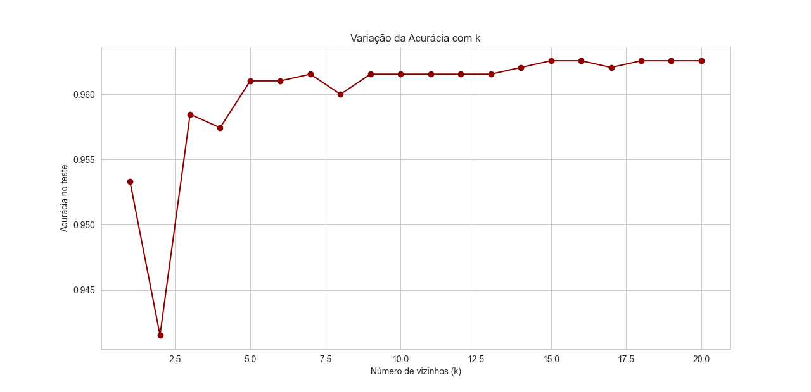

# Exploração de dados KNN

## Entendimento dos Resultados do Dataset

Total de registros: 6.497

Variáveis: 12 (características físico-químicas + qualidade + tipo)

Sem valores ausentes 

## Distribuição da variável quality

A maioria dos vinhos tem notas 5 e 6 (classe intermediária).

Notas muito baixas (3, 4) ou muito altas (8, 9) são raras.

- Isso mostra um desbalanceamento natural → poucas classes extremas.

## Variável alvo (target)

Criada como binária (vinho bom = 1 e ruim = 0).

Distribuição:

1 (bons vinhos): 6.251 registros

0 (ruins): 246 registros

( fortemente desbalanceado.)

O melhor entendimento sobre o Dataset está em [Árvore de Decisão](../arvore-decisao/main.md)

## Desempenho do Modelo KNN

Treino: 4.547 registros

Teste: 1.950 registros

Acurácia geral: 96,1%

## Relatório de Classificação
Classe	    Precision	Recall	    F1-score  Suporte
0 (ruim)	  0.38	    0.04	    0.07	    74
1 (bom)	      0.96	    1.00	    0.98	    1876

Classe 1 (bons vinhos): modelo excelente, quase 100% de acertos.

Classe 0 (ruins): modelo tem baixa performance → acerta muito pouco.

Interpretação

Alta acurácia (96%) não conta toda a história, porque:

O modelo está aprendendo a prever quase sempre a classe “bom”, já que ela é muito mais frequente.

Isso gera alto recall e precisão para bons vinhos, mas quase ignora os ruins.

Problema de desbalanceamento:

Como só 3,8% dos vinhos são ruins, o modelo praticamente “desiste” de classificá-los.

Resultado: classe minoritária (ruins) é mal identificada.

=== "Gráfico de Variação do KNN"
    
 

 ## O que mostra esse gráfico?

Eixo X (horizontal) → valores de k (número de vizinhos considerados pelo algoritmo KNN).

Eixo Y (vertical) → acurácia do modelo no conjunto de teste (proporção de acertos).

Cada ponto do gráfico mostra o desempenho do KNN para um valor específico de k.

# Interpretação
Para k = 1, o modelo tende a memorizar o conjunto de treino, apresentando risco de overfitting.

Já em k = 2, observa-se uma queda na acurácia, evidenciando instabilidade.

Em valores intermediários (k entre 5 e 10), a acurácia se estabiliza em torno de 96%, representando o ponto de maior equilíbrio entre viés e variância.

Para valores maiores de k (acima de 10), o desempenho permanece estável, com acurácia próxima de 96,2%, tornando o modelo mais generalista, pois considera um número elevado de vizinhos e suaviza as diferenças entre as classes.

## Conclusão

O modelo KNN alcançou 96% de acurácia global, mas o desbalanceamento dos dados compromete a detecção da classe minoritária (vinhos ruins). Enquanto o desempenho para vinhos bons foi excelente (recall ≈ 1,00), a classe ruim apresentou métricas muito baixas (precisão 0,38, recall 0,04). Assim, o modelo é eficaz para prever vinhos bons, mas pouco confiável para identificar vinhos ruins.
