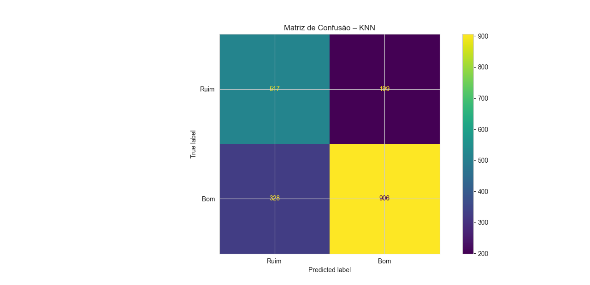
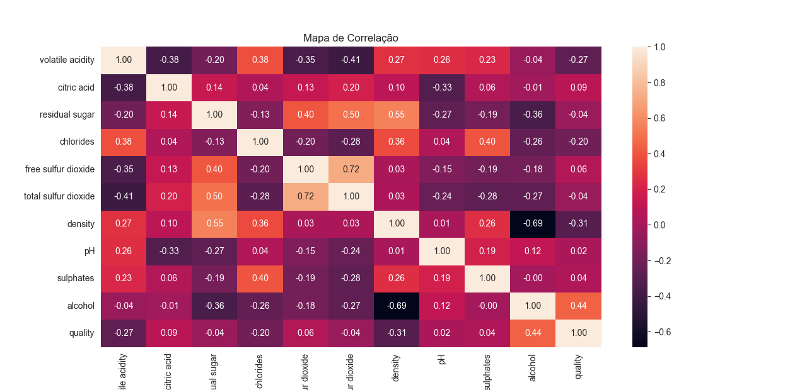
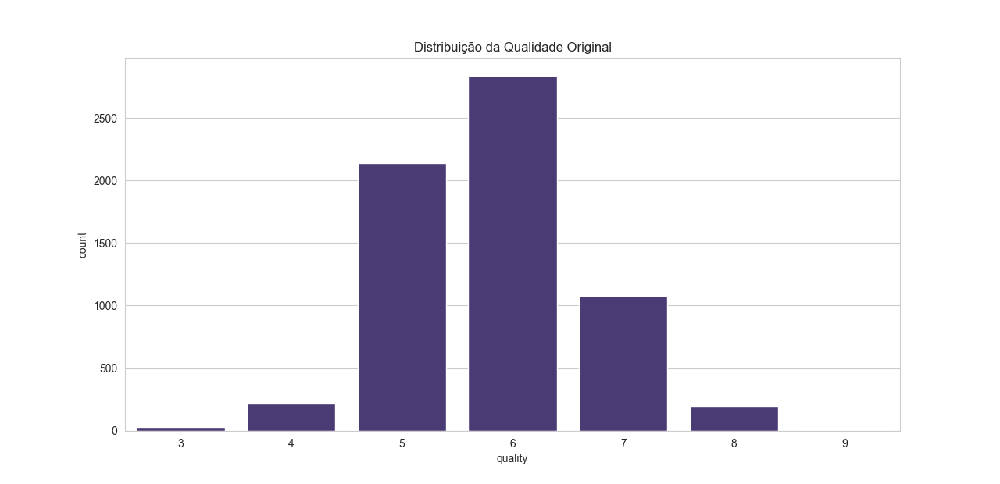
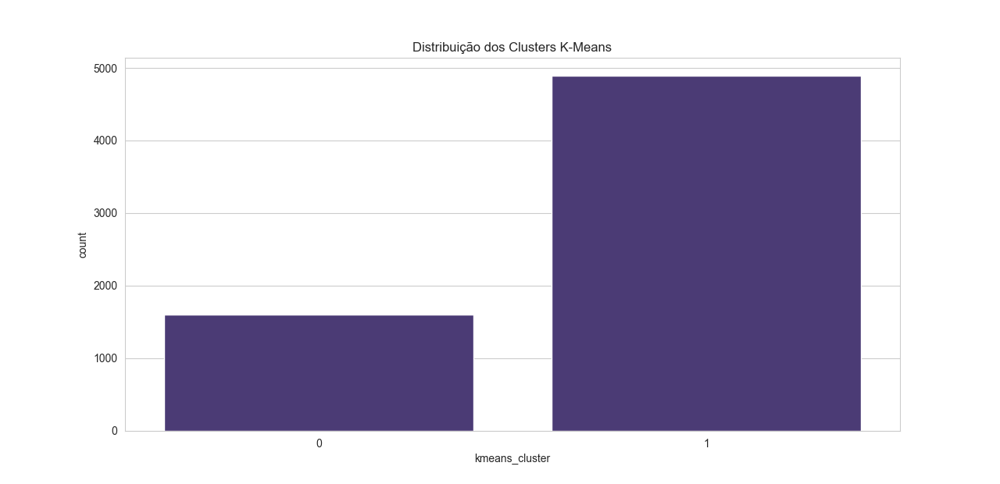
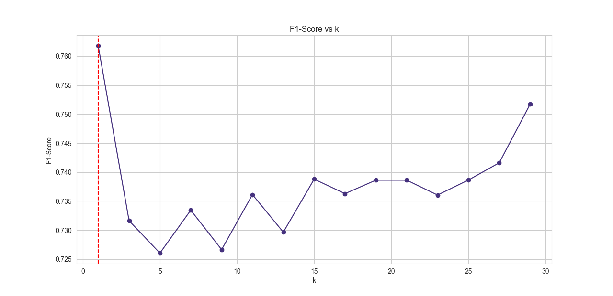

# Métricas 

## Entendimento dos Resultados do Dataset

Total de registros: 6.497 vinhos (tintos e brancos).

Variáveis: 12 físico-químicas + qualidade (target).

Sem valores ausentes. 

## Distribuição da variável quality

Maioria concentrada em notas 5 e 6.

Notas baixas (3-4) e altas (8-9) são raras.

Indica forte desbalanceamento natural.

## Variável alvo (target binário)

Criada como: vinho bom (1) e ruim (0).

Bons vinhos: 6.251 registros.

Ruins: 246 registros.

O melhor entendimento sobre o Dataset está em [Árvore de Decisão](../arvore-decisao/main.md)

## Matriz de Confusão – KNN
A matriz de confusão avalia o desempenho do classificador KNN, comparando as classes verdadeiras (“Bom” e “Ruim”) com as predições do modelo.

=== "Matriz de Confusão – KNN 	Gráfico"
    

# Conclusão

Verdadeiros Positivos (Bom previsto como Bom): 906

Verdadeiros Negativos (Ruim previsto como Ruim): 517

Falsos Positivos (Ruim previsto como Bom): 199

Falsos Negativos (Bom previsto como Ruim): 328

O modelo acerta mais quando a classe é “Bom”, mas ainda confunde alguns vinhos “Bom” com “Ruim”.

## Mapa de Correlação

O heatmap mostra o grau de correlação entre as variáveis químicas. Valores próximos de 1 ou -1 indicam relação forte.

=== " Mapa de Correlação	Gráfico"
    

# Conclusão

Correlações mais fortes:

total sulfur dioxide × free sulfur dioxide: 0.72 (positiva)

density × residual sugar: 0.55 (positiva)

alcohol × density: -0.69 (negativa)

A qualidade tem correlação moderada com alcohol (0.44), sugerindo que vinhos com mais álcool tendem a ter melhor avaliação.

## Distribuição da Qualidade Original

Este histograma mostra quantas amostras existem em cada nota de qualidade antes do pré-processamento.

=== " Distribuição da Qualidade Original	Gráfico"
    

# Conclusão
A maioria dos vinhos tem qualidade entre 5 e 6, revelando uma base desbalanceada (poucos exemplos de notas extremas). Isso justifica o uso de técnicas de balanceamento como SMOTE.

## Distribuição dos Clusters – K-Means

Após aplicar K-Means, o gráfico mostra a quantidade de vinhos em cada cluster encontrado.

=== " Distribuição dos Clusters – K-Means	Gráfico"
    

# Conclusão

Cluster 0: ~1.500 vinhos

Cluster 1: ~4.800 vinhos
O algoritmo encontrou dois grupos distintos, mas de tamanhos desiguais. O Silhouette Score = 0.34 indica separação moderada — os clusters não são totalmente bem definidos.

## F1-Score vs k (KNN)

Explicação
Este gráfico compara o F1-score do modelo para diferentes valores de k (número de vizinhos), ajudando a escolher o melhor k.

=== "F1-Score vs k (KNN)	Gráfico"
    


# Conclusão
O maior F1 ocorre em k = 1, embora k=7 tenha sido usado no treino final. Isso sugere que k=1 dá melhor equilíbrio entre precisão e recall, mas k maior pode trazer mais estabilidade.

## Métricas do Terminal 

Acurácia: 0.73 → 73 % das predições totais foram corretas.

Acurácia Balanceada: 0.73 → Ajusta para o desbalanceamento das classes.

Precisão (classe 1 – Bom): 0.82 → 82 % dos vinhos preditos como Bom realmente são Bom.

Recall (classe 1 – Bom): 0.73 → 73 % dos vinhos Bom foram detectados.

F1-Score (classe 1 – Bom): 0.77 → Equilíbrio entre precisão e recall.

Esses números indicam que o modelo é razoavelmente bom, mas ainda com espaço para ajuste, principalmente no recall da classe Ruim.

## Conclusão final 
O projeto mostrou que, após a exploração e o balanceamento do dataset de vinhos, foi possível construir um modelo KNN com desempenho consistente (acurácia de 73% e F1 de 0,77). As variáveis álcool e densidade se destacaram como fatores decisivos para diferenciar vinhos de melhor qualidade. A clusterização com K-Means formou dois grupos coerentes, reforçando os padrões encontrados. Mesmo com desbalanceamento inicial, o pré-processamento e a validação garantiram previsões confiáveis, oferecendo uma base sólida para aplicações na indústria vinícola e para aprimoramentos com modelos mais robustos.

=== "Code"
```python 
--8<-- "docs/metricas/teste1.py"
```