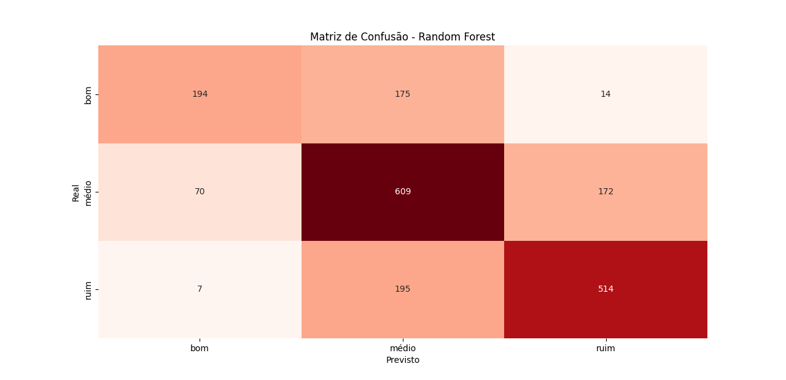
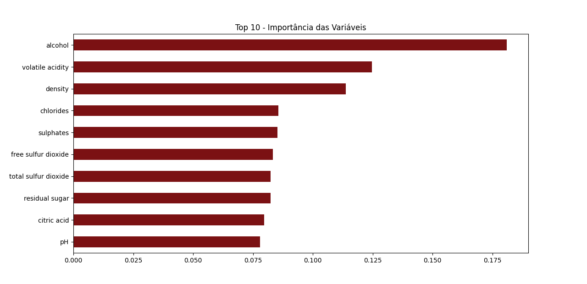

# Random Forest
## Preparação dos dados
Antes de treinar o modelo, os dados foram tratados:

As variáveis categóricas (nomes, cores, tipos) foram transformadas em números;

As variáveis numéricas foram padronizadas com o StandardScaler, para manter todas na mesma escala;

Em seguida, os dados foram divididos em treino (70%) e teste (30%).

O melhor entendimento sobre o Dataset está em [Árvore de Decisão](../arvore-decisao/main.md), [K-means](../kmeans/main.md), [KNN](../knn/main.md) e [Metricas](../metricas/main.md)

## Treinando o modelo

O modelo Random Forest foi treinado com várias árvores de decisão.
Cada árvore aprende de forma diferente, usando partes aleatórias dos dados.
Depois, o modelo escolhe o resultado mais votado entre as árvores, melhorando a precisão.

## Matriz de confusão

=== "Matriz de Confusão Random Forest	Gráfico"
    

Mostra o quanto o modelo acertou ou errou em cada classe.

A diagonal principal indica os acertos.

Fora da diagonal, estão os erros.

 No gráfico, quanto mais escuro o quadrado, melhor o desempenho naquela categoria

## Importância das variáveis

=== "Importância das variáveis	Gráfico"
    

Outro gráfico mostra quais variáveis tiveram mais peso nas decisões do modelo.
As barras em tons de vinho indicam que:

As variáveis no topo são as mais importantes;

As últimas têm pouca influência no resultado.

## 