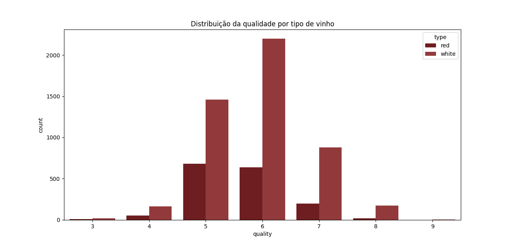
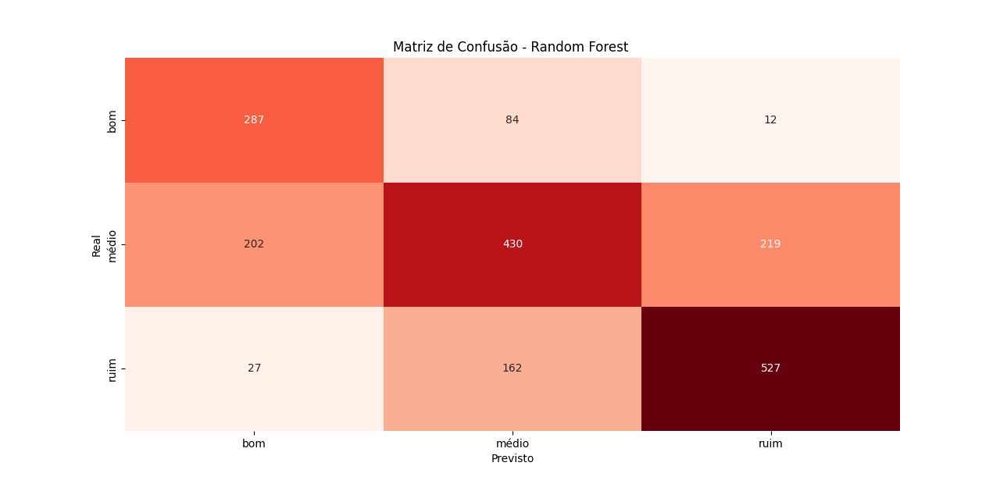
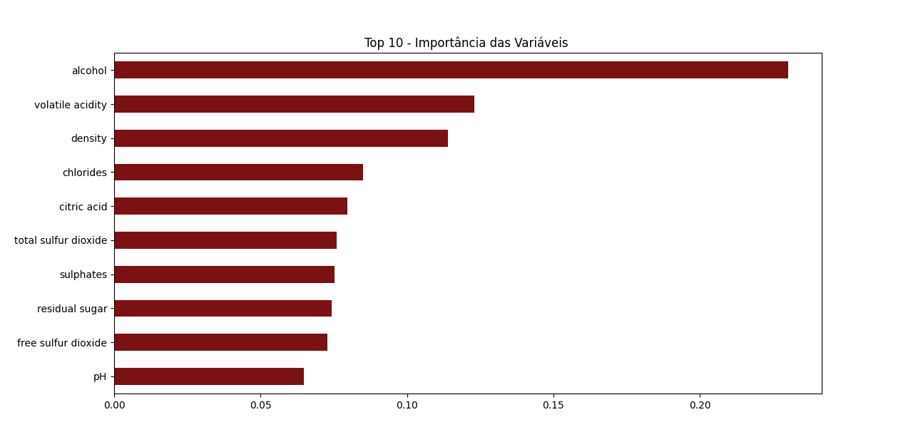
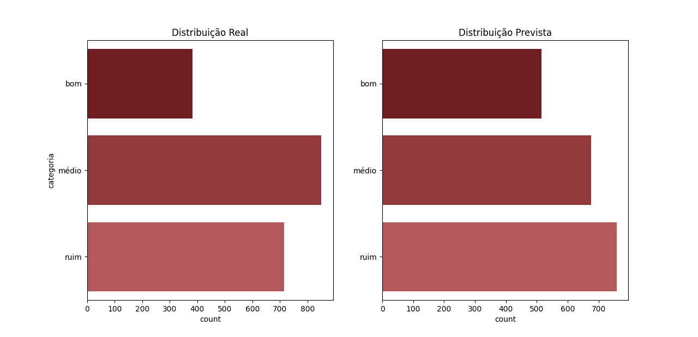
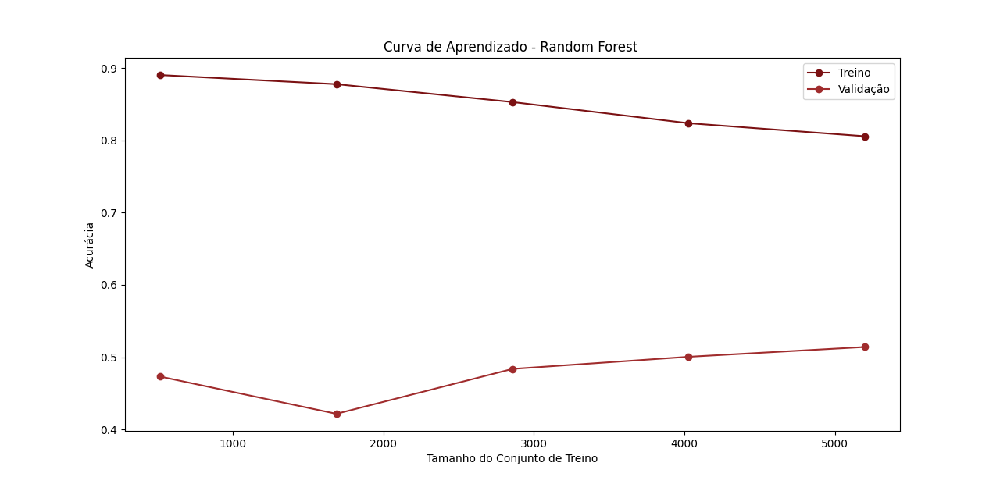
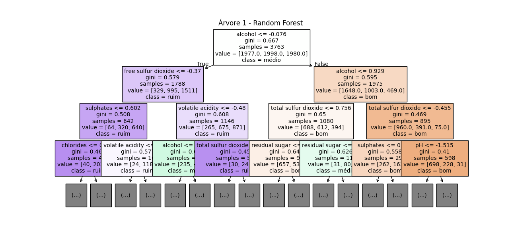
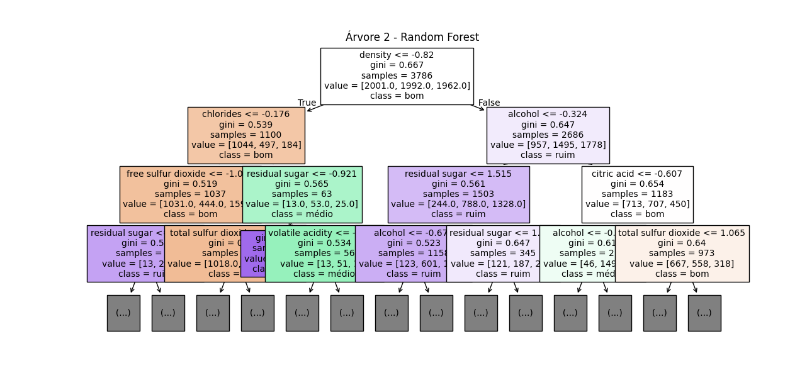

# Random Forest

## Análise Exploratória dos Dados
=== "Distribuição da Qualidade por Tipo de Vinho   Gráfico"
    

Antes da preparação do Random Forest, foi feita uma análise exploratória para entender a distribuição dos dados. O gráfico acima mostra a contagem de vinhos por nota de qualidade (de 3 a 9), separado por tipo (tinto e branco).

Esta visualização foi crucial e justificou duas decisões centrais do projeto:

Categorização: A esmagadora maioria dos vinhos concentra-se nas notas 5, 6 e 7. As notas extremas (3, 4, 8, 9) têm pouquíssimas amostras. Por isso, fez sentido agrupar as notas em três categorias: "ruim" (<=5), "médio" (==6) e "bom" (>=7).

Necessidade de Balanceamento: O gráfico também evidencia que, mesmo após o agrupamento, as classes "bom" e "ruim" são minoritárias em relação à classe "médio". Isso cria um desbalanceamento que foi tratado na etapa de treinamento com a técnica SMOTE.

Preparação dos dados
Com base na análise exploratória, os dados passaram por um pré-processamento detalhado:

Categorização da Saída: A variável-alvo quality foi transformada nas três categorias ("ruim", "médio", "bom").

Variáveis Categóricas: A variável type (tinto/branco) foi transformada em numérica (0 ou 1) usando get_dummies.

Padronização: Todas as variáveis numéricas de entrada (features) foram padronizadas com o StandardScaler, garantindo que todas tivessem a mesma escala.

Divisão: Os dados foram divididos em conjuntos de treino (70%) e teste (30%), com estratificação (stratify=y) para garantir que a proporção das três classes fosse a mesma em ambos os conjuntos.

O melhor entendimento sobre o Dataset está em Árvore de Decisão, K-means, KNN e Metricas.

## Treinando o modelo 
O primeiro modelo treinado apresentou dois problemas: overfitting (sobreajuste) e dificuldade em prever a classe minoritária "bom".

Para corrigir isso, o segundo modelo foi treinado usando um Pipeline com duas etapas:

SMOTE (Synthetic Minority Over-sampling Technique): Aplicado apenas nos dados de treino para criar amostras sintéticas das classes "bom" e "ruim", balanceando o dataset.

GridSearchCV: Uma busca exaustiva foi realizada para encontrar os melhores hiperparâmetros e reduzir o overfitting.

O GridSearchCV testou 24 combinações e os melhores parâmetros encontrados foram:

max_depth: 10

min_samples_leaf: 5

min_samples_split: 5

n_estimators: 100

O modelo final é o RandomForestClassifier treinado com esses parâmetros e com os dados de treino balanceados pelo SMOTE.

## Matriz de confusão

=== "Matriz de Confusão Random Forest	Gráfico"
    

A matriz de confusão mostra o desempenho detalhado do modelo otimizado.

Diagonal Principal (Acertos):

Acertou 287 vinhos 'bons'.

Acertou 430 vinhos 'médios'.

Acertou 527 vinhos 'ruins'.

Análise (Trade-off): O resultado mais importante está no recall (capacidade de encontrar uma classe):

Recall 'bom': 75% (No modelo antigo, era apenas 51%).

Recall 'médio': 51% (No modelo antigo, era 72%).

Conclusão: O SMOTE funcionou. Trocamos a performance da classe 'médio' por uma melhora drástica na identificação da classe 'bom'. A acurácia geral foi de 63.8% (contra 67.5% do modelo antigo), mas o modelo se tornou muito mais útil para identificar vinhos de alta qualidade.

## Importância das variáveis

=== "Importância das variáveis	Gráfico"
    

Este gráfico mostra quais variáveis (features) o modelo otimizado considerou mais importantes para tomar suas decisões.

As barras em tons de vinho indicam que:

alcohol (Teor Alcoólico): Continua sendo, de longe, o fator mais decisivo para prever a qualidade.

volatile acidity (Acidez Volátil): É o segundo fator mais importante.

density (Densidade): Completa o Top 3 das variáveis mais relevantes.

As últimas variáveis, como pH, têm pouca influência relativa no resultado final deste modelo.

## Distribuição Real vs. Prevista

=== "Distribuição Real vs. Prevista	Gráfico"
    

Este gráfico compara a distribuição real das classes no conjunto de teste (esquerda) com o que o modelo previu (direita).

Modelo Antigo (Problema): O modelo antigo tinha um "vício" de prever 'médio', inflando essa barra.

Modelo Otimizado (Resultado): O gráfico da direita mostra que as previsões estão mais equilibradas. O modelo agora prevê ativamente as classes 'bom' e 'ruim', o que confirma que o SMOTE ajudou a remover o viés da classe majoritária.

## Curva de Aprendizado

=== "Curva de Aprendizado	Gráfico"
    

Este é o gráfico de diagnóstico mais importante. Ele plota a acurácia do modelo à medida que ele vê mais dados.

Curva de Treino (vermelha superior): A performance nos dados que o modelo usou para treinar. Termina alta, em ~81%.

Curva de Validação (vermelha inferior): A performance em dados novos (validação cruzada). Termina baixa, em ~51%.

Conclusão (Diagnóstico): A enorme lacuna (gap) entre as duas curvas é um sinal claro de alto overfitting (sobreajuste). Mesmo com o GridSearchCV, o modelo (max_depth=10) ainda é muito complexo, "decorando" os dados de treino em vez de "aprender" a generalizar para dados novos.

## Visualização das Árvores

=== "Árvore 1	Gráfico"
    
=== "Árvore 2	Gráfico"
    

O Random Forest cria centenas de árvores (no nosso caso, 100). Acima estão duas amostras, limitadas a 3 níveis de profundidade para visualização.

Elas mostram como o "aleatório" do nome funciona:

A Árvore 1 começa sua decisão perguntando sobre alcohol.

A Árvore 2 começa sua decisão perguntando sobre density.

Cada árvore é um "especialista" diferente, e a previsão final do modelo é uma "votação" entre todas as 100 árvores.

## Conclusão Final

Classificação de vinhos em três categorias de qualidade: "bom", "médio" e "ruim". A análise inicial revelou um desafio central: um forte desbalanceamento nos dados, com uma super-representação da classe "médio" e uma sub-representação das classes "bom" e "ruim".
O modelo foi otimizado com a técnica de rebalanceamento SMOTE e a busca de hiperparâmetros, a análise dos resultados deste modelo otimizado permitiu tirar as seguintes conclusões:

ucesso na Correção do Desbalanceamento (O Trade-off) O impacto mais significativo da otimização foi a mudança fundamental no comportamento do classificador. O modelo original era incapaz de identificar vinhos "bons", acertando apenas 51% deles (recall). O modelo otimizado, por sua vez, apresentou um recall de 75% para esta mesma classe.

Isso demonstra que a técnica SMOTE foi bem-sucedida em "ensinar" o modelo a reconhecer as características das classes minoritárias. No entanto, esse ganho gerou um trade-off: a performance na classe "médio" (anteriormente a mais fácil) caiu de um recall de 72% para 51%. A acurácia geral do modelo estabilizou-se em 63,8%, refletindo essa nova especialização. A matriz de confusão e os gráficos de distribuição confirmam que o modelo final é menos enviesado para a classe "médio" e faz previsões mais equilibradas.

Identificação dos Preditores Chave A análise de importância das variáveis (feature_importances_) foi conclusiva e consistente. O teor alcoólico (alcohol) se destacou como o preditor mais influente, com um peso significativamente maior que todas as outras variáveis. Em seguida, a acidez volátil (volatile acidity) e a densidade (density) apareceram como fatores secundários, mas ainda cruciais, para a tomada de decisão da floresta.

Diagnóstico Final do Modelo (Overfitting) A "Curva de Aprendizado" do modelo final fornece o diagnóstico definitivo sobre sua complexidade. Os gráficos mostram uma lacuna (um gap) muito grande e persistente entre a curva de acurácia do treino (que termina em ~81%) e a curva de validação (que se estabiliza em ~51%).

Este padrão é a definição clássica de um modelo com alta variância, ou overfitting (sobreajuste). Embora o GridSearchCV tenha selecionado a configuração com max_depth=10 como a de melhor performance durante o tuning, o resultado é um modelo que "decorou" os dados de treino com grande eficiência, mas que possui uma capacidade de generalização substancialmente menor para dados novos e desconhecidos.

Final: O trabalho produziu com sucesso um modelo Random Forest que resolveu o problema central do desbalanceamento de classe, criando um classificador especializado e eficaz na detecção de vinhos 'bons'. A análise final revela que este ganho de especialização resultou em um modelo complexo, que demonstra um claro comportamento de sobreajuste aos dados de treinamento.
